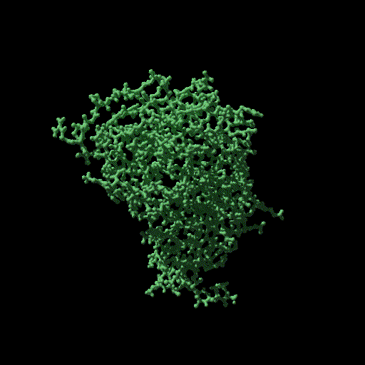

# Minimal Blender + Molecular Nodes CLI

## Running

```sh
pixi run help
pixi run example  # this makes the example in this directory ...
pixi run wobble
```

## Result



## Background

This is a distilled version of [mol-nodes utils](https://github.com/zachcp/molnodes-utils). Basically, you need only extract a node gorup of interest
and register it as a class for it to be available for use as a node in a scriptable environment. It opens up the possibility o making
custom, reproducible figures on top of Molecular Nodes
